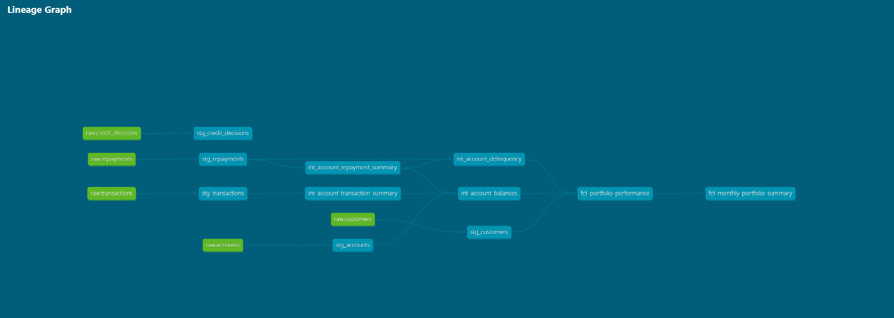
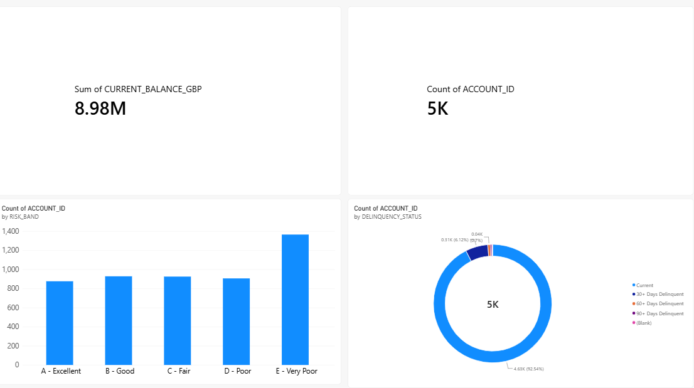

# UK Cards Analytics Warehouse


A production-style analytics warehouse for a UK credit card portfolio. It turns raw customer, account, transaction, repayment and credit-decision data into tested, documented, analysis-ready datasets, using **Snowflake**, **dbt**, **Python**, **GitHub Actions** and **Power BI**.

All data is synthetic, generated by the Python scripts in this repo.

## Business questions it answers

- How much of their credit limit are customers using?
- Which accounts are sliding into delinquency (30 / 60 / 90+ days)?
- How does risk (A-E band) relate to balances, utilisation and missed payments?
- What does the portfolio look like at a glance for investor reporting?
- What share of applicants are approved, and why are others declined?

## Architecture

```
Python generators
       |
   CSV files
       |
Python loader (PUT + COPY INTO)
       |
Snowflake RAW
       |
dbt staging        clean and standardise (views)
       |
dbt intermediate   reusable business logic (views)
       |
dbt marts          analysis-ready (tables)
       |
Power BI
```



| Layer | Models | Purpose |
|---|---|---|
| Raw | 5 tables | Source data exactly as received |
| Staging | `stg_customers`, `stg_accounts`, `stg_transactions`, `stg_repayments`, `stg_credit_decisions` | Light cleaning: trimming, lower-casing, blanks to NULL |
| Intermediate | `int_account_transaction_summary`, `int_account_repayment_summary`, `int_account_balances`, `int_account_delinquency` | Reusable calculations: balances, utilisation, delinquency tiers (window functions) |
| Marts | `fct_portfolio_performance`, `fct_monthly_portfolio_summary` | Account-level performance with risk bands; portfolio-level investor summary |

## Dashboard



The Power BI file is in `reporting/`. It connects directly to the dbt marts in Snowflake.

## Data quality and CI

- **33 automated dbt tests**: uniqueness, not-null, referential integrity (`relationships`), and accepted-value checks across the staging layer and both marts
- **GitHub Actions CI** rebuilds every dbt model from the `RAW` tables in an isolated `DBT_CI` schema and runs every test on each push to `main`
- The Python loader is idempotent (safe to re-run) and reconciles each table's row count against its source CSV
- Snowflake credentials are held in encrypted GitHub Secrets and never appear in the repo
- dbt documentation and lineage are generated with `dbt docs generate`

## Repo structure

```
data_generation/    Python scripts that create the synthetic datasets
ingestion/          Python loader: stages the CSVs and bulk-loads them into Snowflake RAW
warehouse_setup/    Snowflake SQL: warehouse, database, raw tables, cost settings
dbt_project/        dbt models (staging, intermediate, marts), sources and tests
reporting/          Power BI dashboard (.pbix)
.github/workflows/  CI pipeline
```

## Data volumes

| Dataset | Rows |
|---|---|
| Customers | 5,000 |
| Accounts | 5,000 |
| Transactions | 356,666 |
| Repayments | 44,841 |
| Credit decisions | 7,200 (69.4% approved) |

## Running it yourself

You will need a Snowflake account, Python 3.12+, and Git.

```bash
git clone https://github.com/Folorunsho-oz-Daniel/uk-cards-analytics-warehouse.git
cd uk-cards-analytics-warehouse
python -m venv venv
# activate the venv, then:
pip install -r requirements.txt
```

**Step 1: generate the data** (run in this order)

```bash
python data_generation/generate_customers.py
python data_generation/generate_accounts.py
python data_generation/generate_transactions.py
python data_generation/generate_repayments.py
python data_generation/generate_credit_decisions.py
```

**Step 2: create the Snowflake objects**

In Snowflake, run the scripts in `warehouse_setup/`: `01` and `02` create the warehouse, database and raw tables. `03` is an optional row-count check. `04` is cost housekeeping specific to the original account, so edit the names in it or skip it.

**Step 3: load the CSVs into the `RAW` tables**

Set the connection settings as environment variables (`SNOWFLAKE_ACCOUNT`, `SNOWFLAKE_USER`, `SNOWFLAKE_ROLE`, `SNOWFLAKE_WAREHOUSE`, `SNOWFLAKE_DATABASE`), then run:

```bash
python ingestion/load_raw_tables.py
```

The script asks for your password at a hidden prompt, reloads each table, and checks every row count against its CSV.

**Step 4: configure dbt**

Create your own dbt `profiles.yml` (profile name `dbt_project`) pointing at your Snowflake account. This file is deliberately not in the repo.

**Step 5: build and test**, from inside `dbt_project/`:

```bash
dbt run
dbt test
dbt docs generate && dbt docs serve
```
## Known limitations

- **Negative account balances**: `current_balance_gbp` can be negative for some accounts. Transactions and repayments were generated as two independent synthetic datasets, so some accounts repay more than they spend. This is left visible rather than floored at zero, because flooring would hide the underlying data-generation choice. A production system would derive balance from a single authoritative ledger.
- **Simplified balance model**: balance is net spend minus repayments, with no interest or fees applied.
- **Credit score scale**: scores use a simplified 300-850 range, not a UK bureau scale. Risk band E covers a wider score range (300-449) than the others, so it holds more accounts.
- **Blank delinquency status**: a small number of accounts have no repayment history, so they have no delinquency status.
- **Snapshot reporting**: `fct_monthly_portfolio_summary` stamps today's date on each run. Scheduled runs would be needed to build true history.

## Possible extensions

This project focuses on the modelling, testing and CI layers. Natural next steps for a production version:

- Incremental models for the transactions table, to avoid full rebuilds as volume grows
- A pricing and profitability mart
- Reconciliation tests tying investor-report totals back to the account-level mart
- Role-based access in Snowflake (separate loader, transformer and reporting roles)
- Incremental, watermark-based ingestion (the current loader does a full refresh each run)